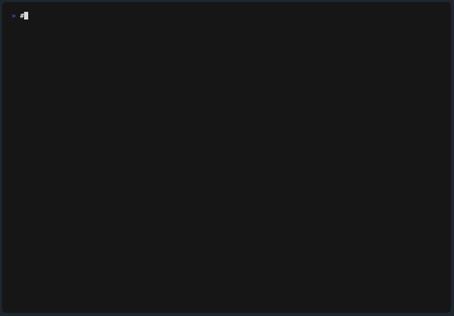

# orphan-files

<p align="center">
  
</p>

<!-- prettier-ignore-start -->

[](#cli)
[](https://www.npmjs.com/package/orphan-files)
[](https://badge.fury.io/js/orphan-files)
[](https://www.npmjs.com/package/orphan-files)
[](https://packagephobia.com/result?p=orphan-files)
[](https://piecioshka.mit-license.org)
[](https://github.com/piecioshka/orphan-files/actions/workflows/ci.yml)

<!-- prettier-ignore-end -->

🔨 Find the files your project stopped using — including the ones that only import each other.

```bash
npx orphan-files
```



Most tools ask _"does anything import this file?"_. That question misses **dead islands**: a group of files that import each other, but which nothing reachable ever imports. They keep each other "used" forever.

`orphan-files` instead walks the import graph **from your entry points outwards** (`import`, `require`, dynamic `import()`, `import.meta.glob`, `jest.mock`, `export * from`, …). Anything the walk never reaches is unused — islands included.

Here `report-builder` and `report-utils` import each other, and nothing else imports either of them. An `importedBy > 0` check calls both "used"; a reachability walk reports both:

```console
$ npx orphan-files
Found 2 unused files (204 B, 7 LOC reclaimable):

src/legacy/report-builder.js  89 B
src/legacy/report-utils.js    115 B

$ npx orphan-files --why src/legacy/report-builder.js
src/legacy/report-builder.js: unused — not reachable from any entry point
```

> Give a ⭐️ if this project helped you!

## Features ✨

- 🧠 True reachability analysis — dead islands that only import each other don't mask each other
- 🌳 Babel AST parsing — JSX, TypeScript, decorators, top-level await
- 🧭 Framework auto-detection — Next.js, Vite, Storybook, Remotion
- 🗺️ Resolves `tsconfig` path aliases and `baseUrl`
- 📊 Four output formats — `cli`, `json`, `sarif`, `pdf`
- 🧹 Auto-deletion — `--fix` (dry-run) and `--force`
- 🔍 Explainability — `--why <file>` tells you why a file is kept or unused
- 🕸️ Graph export — `mermaid`, `dot`, `html`
- 📏 Baseline for incremental adoption
- 🤖 Ready-made composite GitHub Action with SARIF for the Code scanning tab
- 📦 Monorepo support — honours each workspace package's entry points
- 🙈 Honours `.gitignore`

## Why not just use knip?

[knip](https://www.npmjs.com/package/knip) is the de-facto standard and does **much more** than this tool: unused files, exports, dependencies, and ~150 framework plugins. If you want one tool for all of that, use knip.

`orphan-files` deliberately does **one job**: whole unused files. That focus is what it buys you:

|  | `orphan-files` | Typical file-level alternatives |
| --- | --- | --- |
| Analysis model | Reachability from entry points — **catches dead islands** | Usually `importedBy == 0`, which islands defeat |
| "Why is this file kept?" | `--why <file>` prints the import chain | Rarely available |
| Output formats | `cli`, `json`, **`sarif`**, **`pdf`** | Usually `cli` only |
| CI adoption on a legacy repo | `--baseline` + `--max-unused` | Often all-or-nothing |
| GitHub integration | Composite Action + SARIF → Code scanning tab | Usually DIY |
| Graph export | `mermaid`, `dot`, `html` | Separate tool |

Full, sourced breakdown of 20+ tools: **[docs/comparison.md](docs/comparison.md)**.

## How it works

1. Globs the project for source files (honouring `.gitignore` and your `exclude` patterns).
2. Parses each file with Babel and extracts every import specifier.
3. Resolves each specifier (relative paths, `tsconfig` path aliases, `baseUrl`, `import.meta.glob`).
4. Determines **entry points** — `package.json` (`main`/`module`/`exports`/`bin`/`types`), framework conventions (Next.js, Vite, Storybook, Remotion…), tests, configs, `index`/`main` barrels, and your config.
5. Walks the graph from those entry points; anything it can't reach is unused.

This is a true reachability analysis: two dead files that import each other will **not** mask each other.

## Installation

```bash
npm install -g orphan-files
```

## CLI

```bash
# scan current directory
orphan-files

# scan a specific project
orphan-files /path/to/project

# preview what would be deleted, then actually delete
orphan-files --fix
orphan-files --fix --force

# explain why a file is kept (or unused)
orphan-files --why src/utils/helpers.ts

# CI: machine-readable output (exit code 1 when unused files are found)
orphan-files --format json
orphan-files --format sarif > orphan.sarif

# scaffold a config file
orphan-files --init
```

### Options

| Option | Description |
| --- | --- |
| `-c, --config <path>` | Config file (default: `orphan-files.config.js`) |
| `-f, --format <type>` | Output: `cli`, `json`, `sarif`, `pdf` (default: `cli`) |
| `--sort <key>` | Sort unused files: `path`, `name`, `size` |
| `--group` | Group unused files by directory |
| `--why <file>` | Explain why a file is kept or unused, then exit |
| `--graph <type>` | Print the dependency graph: `mermaid`, `dot`, `html` |
| `--fix` | Preview files that would be deleted (dry-run) |
| `--force` | With `--fix`, actually delete the files |
| `--baseline <path>` | Ignore unused files recorded in a baseline file |
| `--update-baseline [path]` | Write the current unused files as the baseline, then exit |
| `--max-unused <n>` | Exit `0` when the unused count is at most `<n>` |
| `--no-gitignore` | Do not honour `.gitignore` |
| `--init` | Write a starter config file, then exit |
| `-v, --version` | Print version |
| `-h, --help` | Show help |

### Incremental adoption (baseline)

Record the current unused files and fail CI only on **new** ones:

```bash
npx orphan-files --update-baseline        # writes .orphan-files-baseline.json
npx orphan-files --baseline .orphan-files-baseline.json
```

### Visualise the dependency graph

```bash
npx orphan-files --graph mermaid          # paste into a Mermaid renderer
npx orphan-files --graph html > graph.html
```

## Configuration

Create an `orphan-files.config.js` file in your project root:

```js
export default {
  include: ["**/*.{js,jsx,ts,tsx,mjs,cjs}"],
  exclude: [
    "**/node_modules/**",
    "**/dist/**",
    "**/.next/**",
    "**/storybook-static/**",
  ],
  // Entry points: kept, and everything they import is kept transitively.
  entry: ["src/index.ts"],
  // Also treated as entry points (kept and seed reachability).
  exceptions: [
    "index.{js,ts}",
    "*.config.{js,ts,mjs,cjs}",
    "**/*.test.{js,ts,tsx}",
    "**/*.spec.{js,ts,tsx}",
    "bin/**",
    "scripts/**",
  ],
};
```

Config files may be `.js`, `.mjs`, `.cjs` (default export) or `.json`. Monorepos are supported: each workspace package's `package.json` entry points are honoured.

### Framework auto-detection

The tool reads `package.json` and automatically adds exceptions for known frameworks:

| Framework | Detected exceptions |
| --- | --- |
| **Next.js** | `app/**/page.tsx`, `app/**/route.ts`, `app/**/layout.tsx`, `sitemap.ts`, `middleware.ts`, etc. |
| **Storybook** | `**/*.stories.{ts,tsx}` |
| **Remotion** | `remotion.config.*`, `src/index.ts` |

### TypeScript path aliases

Reads `tsconfig.json` and resolves path aliases automatically (e.g. `@/*` → `src/*`).

## Supported import expressions

- `import '...'` / `import x from '...'`
- `require('...')`
- `import('...')` (dynamic import) — template literals like ``import(`./pages/${name}.js`)`` are matched as a glob
- `import.meta.glob('./dir/*.js')` (Vite)
- `jest.mock('...')` / `vi.mock('...')`
- `export * from '...'` / `export { x } from '...'`

Files using **decorators** (Angular, NestJS, TypeORM, MobX) and other modern TypeScript syntax are parsed correctly.

## GitHub Action

Run it in CI and fail the build when unused files appear:

```yaml
# .github/workflows/orphan-files.yml
name: orphan-files
on: [push, pull_request]
jobs:
  unused:
    runs-on: ubuntu-latest
    steps:
      - uses: actions/checkout@v7
      - uses: piecioshka/orphan-files@v1
```

### Inputs

| Input | Default | Description |
| --- | --- | --- |
| `directory` | `.` | Project directory to scan |
| `format` | `cli` | Output format: `cli`, `json`, `sarif`, `pdf` |
| `args` | _(none)_ | Extra CLI arguments, e.g. `--baseline .orphan-files-baseline.json` |
| `output-file` | _(none)_ | Write the report to this file instead of stdout |
| `version` | `latest` | npm version/tag of `orphan-files` to run |

### Outputs

| Output | Description |
| --- | --- |
| `unused-count` | Number of unused files found |
| `reclaimable-bytes` | Total size of those files, in bytes |
| `total-files` | Number of files scanned |
| `report-file` | Path the report was written to, when `output-file` was given |

The three counters are read from the JSON report, so they are only set when `format: json`. Other formats leave them empty rather than paying for a second scan.

```yaml
- uses: piecioshka/orphan-files@v1
  id: orphans
  with:
    format: json
    args: "--max-unused 5"
  continue-on-error: true
- run: echo "${{ steps.orphans.outputs.unused-count }} unused files, ${{ steps.orphans.outputs.reclaimable-bytes }} B reclaimable"
```

The action exits with code `1` when unused files are found, so the job fails by default. Use `args: "--max-unused <n>"` or a [baseline](#incremental-adoption-baseline) to adopt it incrementally.

### Code scanning (SARIF)

Upload SARIF to get inline annotations in the GitHub "Code scanning" tab:

```yaml
# .github/workflows/orphan-files.yml
name: orphan-files
on: [push, pull_request]
permissions:
  contents: read
  security-events: write
jobs:
  unused:
    runs-on: ubuntu-latest
    steps:
      - uses: actions/checkout@v7
      - uses: piecioshka/orphan-files@v1
        with:
          format: sarif
          output-file: orphan.sarif
        continue-on-error: true
      - uses: github/codeql-action/upload-sarif@v3
        with:
          sarif_file: orphan.sarif
```

Without the action (plain `npx`):

```yaml
- run: npx orphan-files --format sarif > orphan.sarif
```

## API

```js
import {
  scanProject,
  extractImports,
  analyze,
  findUnusedFiles,
  explainFile,
} from "orphan-files";

const files = await scanProject("/path/to/project", "**/*.{js,ts}");
const fileImports = {};
for (const file of files) {
  fileImports[file] = extractImports(file);
}

// High-level: graph + entry points + reachability + unused list
const result = analyze(files, fileImports, { projectDir: "/path/to/project" });
console.log(result.unused);
console.log(explainFile(files[0], result, "/path/to/project"));

// Or the simple helper (exceptionPatterns double as entry points):
const unused = findUnusedFiles(files, fileImports, [], "/path/to/project");
console.log(unused);
```

---

## 🤝 Contributing

Contributions, issues and feature requests are welcome!<br /> Feel free to check [issues page](https://github.com/piecioshka/orphan-files/issues/).

## Related packages

> [!TIP] See **[docs/comparison.md](docs/comparison.md)** for a sourced, up-to-date comparison of 20+ tools against `orphan-files` — analysis model, file/export/dependency detection, monorepo support, output formats and maintenance status.

**Closest alternatives** (whole files + reachability + standalone CLI):

- **[knip](https://www.npmjs.com/package/knip)** — the de-facto standard; files, exports and dependencies, ~150 framework plugins.
- **[skott](https://www.npmjs.com/package/skott)** — builds and visualises the dependency graph, detects disconnected files.
- **[rev-dep](https://www.npmjs.com/package/rev-dep)** — tracks imports, detects unused code, fast CLI.

**Different job, complementary** — unused _exports_ ([ts-unused-exports](https://www.npmjs.com/package/ts-unused-exports), [find-unused-exports](https://www.npmjs.com/package/find-unused-exports), [tsr](https://www.npmjs.com/package/tsr)), _local dead code_ ([dead-code-checker](https://www.npmjs.com/package/dead-code-checker)), _dependencies_ ([depcheck](https://www.npmjs.com/package/depcheck)), _imports_ ([eslint-plugin-unused-imports](https://www.npmjs.com/package/eslint-plugin-unused-imports)) and _graph visualisation_ ([madge](https://www.npmjs.com/package/madge)).

**Bundler plugins** require running a build, unlike a static CLI — [webpack-deadcode-plugin](https://www.npmjs.com/package/webpack-deadcode-plugin), [vite-plugin-unused-code](https://www.npmjs.com/package/vite-plugin-unused-code), [rollup-plugin-unused](https://www.npmjs.com/package/rollup-plugin-unused), [unplugin-slim](https://www.npmjs.com/package/unplugin-slim).

**Unmaintained** — [unimported](https://www.npmjs.com/package/unimported) _(archived 2024)_, [depcheck](https://www.npmjs.com/package/depcheck) _(archived 2025)_, [deadfile](https://www.npmjs.com/package/deadfile), [next-unused](https://www.npmjs.com/package/next-unused), [orphan](https://www.npmjs.com/package/orphan).

---

## License

[The MIT License](https://piecioshka.mit-license.org) @ 2026
